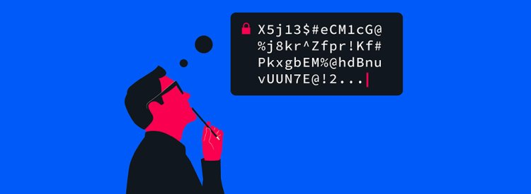

  
<h1 align="center"><a href="https://elmarcz.github.io/Passwords">Passwords</a></h1>

A password generator using Javascript and React

<h3 align="center">🔨 Built with ⚙️</h3>

   
      
   
  

## 📝 Description
A passwords generator using React

## 📱 Website link
- [Link](https://elmarcz.github.io/Passwords)

## ⚙ Build the app

### 👤 Stay in touch
- [Website](https://elmarcz.github.io/portfolio/)
- [Twitter](https://twitter.com/MarcMedrano15)
- [Discord](https://discord.com/invite/zPSYDGVXxx)
- [Instagram](https://www.instagram.com/marcmedranoz/)

### 🔅 Made by Marc Medrano 
